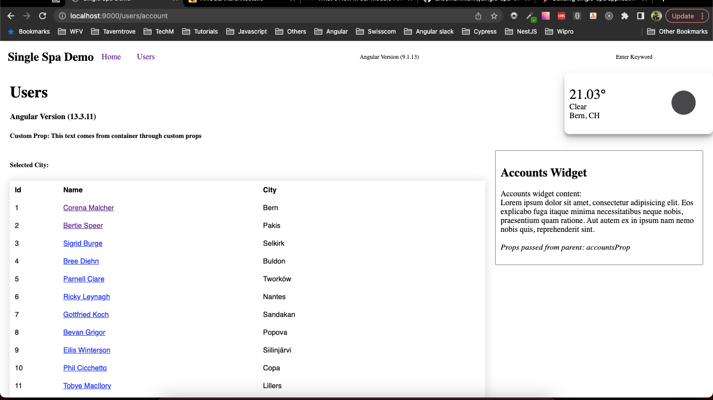

# Single SPA Demo

### Features:

- Single Spa router config
- Custom Props
- Integrating different versions of Angular application
- Integrating Webcomponent
- Intercommunication between Microfrontends
- Sharing dependencies
- Scope wise sharing dependencies
- Import map overrides
- Creating/Using Angular Parcels
- Integrating Angular Library (With secondary entry points)

## Installation

1. Install **pnpm** package globally
   ```
   npm i -g pnpm
   ```
2. **Root directory**, **navigation** & **users**
   ```
   pnpm install
   ```
3. CD into **root-config** and **utility** and run:
   ```
   pnpm install
   ```

## Run Application

In the root directory run:

```
npm start
```
*note* currently broken, Instead use 

```
npm run old-start-script
```

You can access the application at - [http://localhost:9000/](http://localhost:9000/)

## Tracking Errors

1. options has an unknown property 'firewall'

   Use this version - "webpack-config-single-spa-ts": "^3.0.0",

2. Uncaught Error: Unable to resolve bare specifier '@demo/utility'

   Check if the module is added in the importmap
   Check if the import map is valid (No Missing/extra comma)

## Other Useful Links:

### Using Angular core as shared dependency

[https://github.com/esm-bundle/angular\_\_core](https://github.com/esm-bundle/angular__core)

### Installling specific version of Angular:

```
npx @angular/cli@9 new navigation
```

## Screenshot

